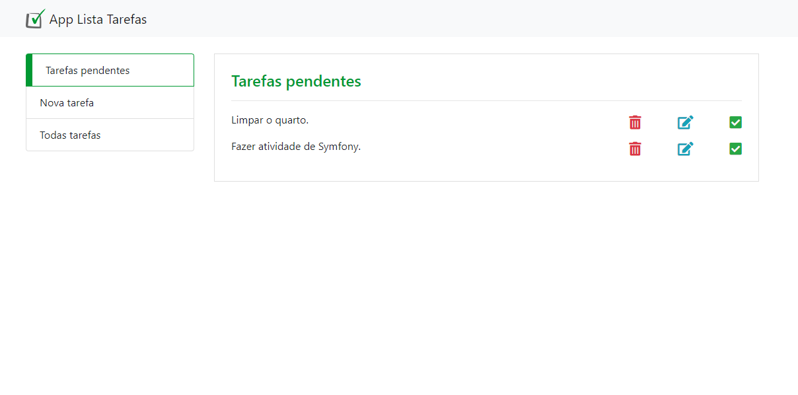
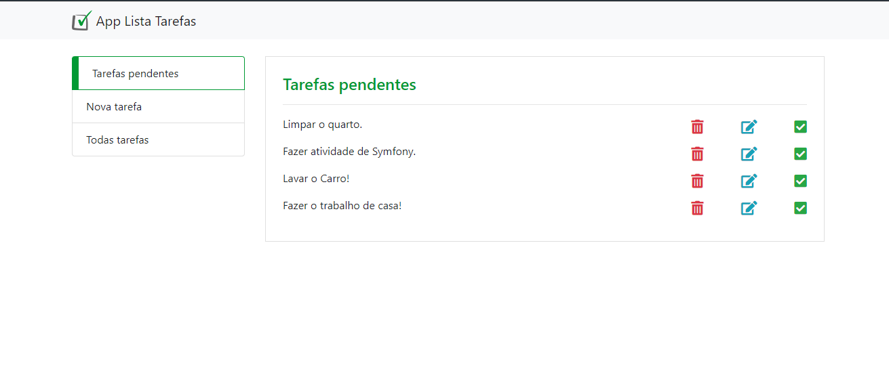

<h1 align="center"> Lista de tarefas </h1>

# Resumo do projeto
Projeto CRUD simples, para atender a necessidade de gerir o tempo e afazeres, onde, se tem a vantagem de estar no controle do que está pendente e o que ja realizou de tarefas simples até as complexas.

Funcionalidade 1: Na aba de "Nova tarefa" é onde pode-se iniciar sua rotina com o APP, criando uma tarefa.

  

Funcionalidade 2: Na aba de "Tarefas pendentes", exibe as tarefas que estão com o status pendente.

  

Funcionalidade 3: Na aba de "Todas Tarefas", é possivel visualizar e interagir com as tarefas, assim podendo edita-las.

  

Funcionalidade 3a: Também na aba de "Todas tarefas", podemos marcar a tarefa como realizada, assim, a tarefa deixará de ser exibida na aba "Tarefas Pendentes".

  

Funcionalidade 3b: Também podemos excluir as tarefas caso já tenha sido realizada ou por não ser mais necessária.  

  

## 📁 Acesso ao projeto

**Você deve baixar a branch [principal(main)](https://github.com/Alan-RiBas/task-list) onde terá o front-end, e uma pasta separada para os controllers que funcionará como o back-end, que você deve baixar na branch [secundaria(controllers)](https://github.com/Alan-RiBas/task-list/tree/controllers).**

## 🛠️ Abrir e rodar o projeto

**Você deverá importar o arquivo.SQL para o seu SGBD, para ter as tabelas necessárias de funcionamento do APP, após isto, inicie o servidor, para rodar o projeto.**  

## ✔️ Técnicas e tecnologias utilizadas

- ``Bootstrap``
- ``PHP 7``
- ``JavaScript``
- ``PDO``
- ``Paradigma de orientação a objetos``
